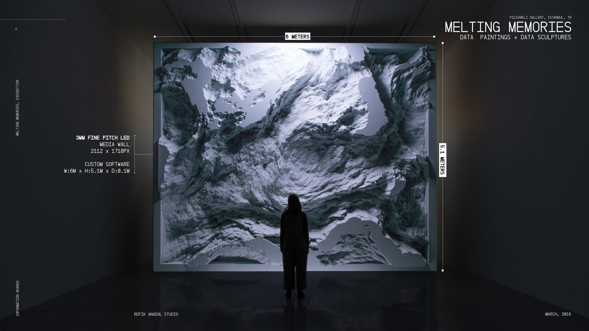
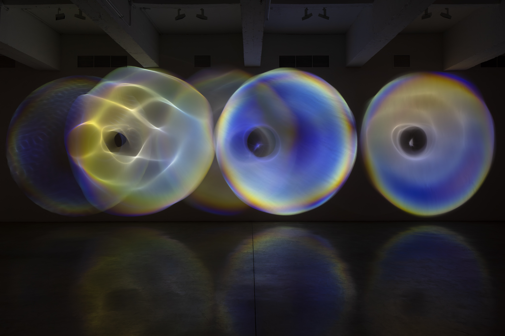

# jiyu0564_9103_tut02_major-project

## Interactive description of the work
Users can start interacting with the work by clicking the play button on the screen. When the button is clicked, the audio and animation will start simultaneously, and the animation will change in frequency and amplitude in response to the audio.

## Detailed information
1. I chose ‘Audio’ to drive my individual code.
2. The core attributes of the image (such as size, circle radius, square side length) will be affected by the audio frequency and animated in real time. The colours of some components will change with the treble and bass of the music, enriching the overall visual dynamics.
3. Inspired by dynamic visual artworks, especially those by artists who visualise audio, such as Refik Anadol and Olafur Eliasson. Anadol's work 'Melting Memories'(Image1) generates flowing dynamic shapes through the spectral analysis of music, making the audience feel that sound can be ‘touched’. Olafur Eliasson's ‘Your Sound Galaxy’(Image2) uses a combination of light and sound at different frequencies to generate a visual effect that looks like a starry sky, with audio controlling the changes in light and shadow to present dynamic geometric shapes.

Image1
 Image2

These visual effects add a sense of rhythm to my work, allowing the audience to intuitively feel the ups and downs of the music. This synchronised graphical change enhances the expressive power of the work, especially in the interaction between the visuals and the audio.
4. The p5.FFT is used to analyse the frequency and amplitude data of the audio in real time.
Depending on the specific frequency band selected in the audio spectrum, the size and position of each graphical component is modified in real time, and some of the graphics also change colour.
When the user clicks the play button, all the components are displayed simultaneously, and through audio-driven animation effects, each graphical element responds to the rhythm of the music in real time.
